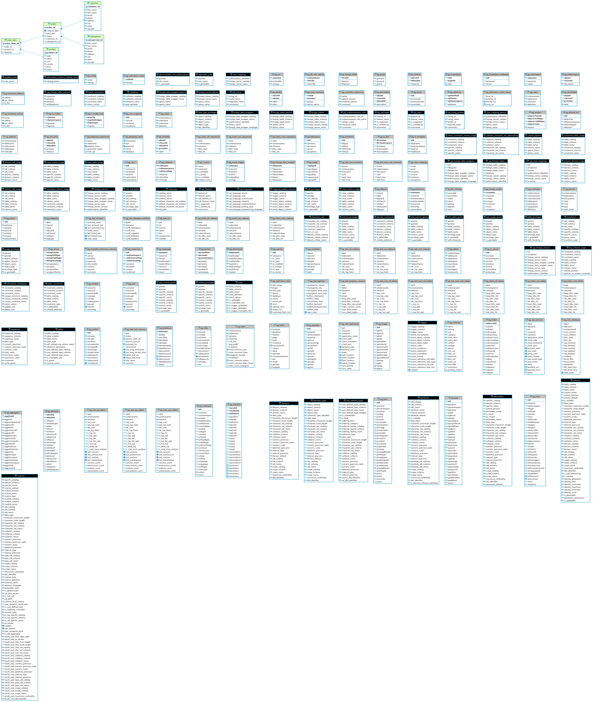

# Introduction
This application performs CRUD (Create, Read, Update, Delete)
operations on a table using Java's JDBC API. The table on which 
the CRUD operations are performed is the Customers table, and it resides
within a PostgreSQL database that is containerized using Docker. The Customers table
stores information on multiple customers, such as their first and last names, emails, phone numbers
and address.

The project was built in Java using the IntelliJ IDE and relies on the Maven project management tool.

# Implementation
## ER Diagram

## Design Patterns
This project uses the Data Access Object (DAO) design pattern. The DAO is a structural pattern that allows for the 
isolation of the application/business layer from the relational database (or some other persistence mechanism) using an 
abstract API. The API hides from the application all the complexity of performing CRUD operations in the underlying storage mechanism.
This allows for a clear separation of concerns between the business layer and the database.
In the project, the DAO is defined within the DataAccessObject.java abstract class. The CustomerDAO.java class extends DataAccessObject.java
and implements the methods findById(), findAll(), update(), create() and delete().

A DAO may rely on a Data Transfer Object(DTO), which is used to transfer data between two processes. In this application, there is a DataTransferObject.java 
interface, which is implemented by the Customer.java class.

Although this project uses the DAO pattern, an alternate pattern that is often used is the Repository pattern.
The Repository pattern is a mechanism for encapsulating storage, retrieval, and search behavior, which emulates a collection of objects. It
also deals with data and hides queries similar to DAO. However, it sits at a higher level, closer to the business logic of an app.
Consequently, a repository can use a DAO to fetch data from the database and populate a domain object. Or, it can prepare the data from a domain object and send it to a storage system using a DAO for persistence.

# Test
The application was tested by accessing the PostreSQL database and then running several queries to ensure the application works as intended.