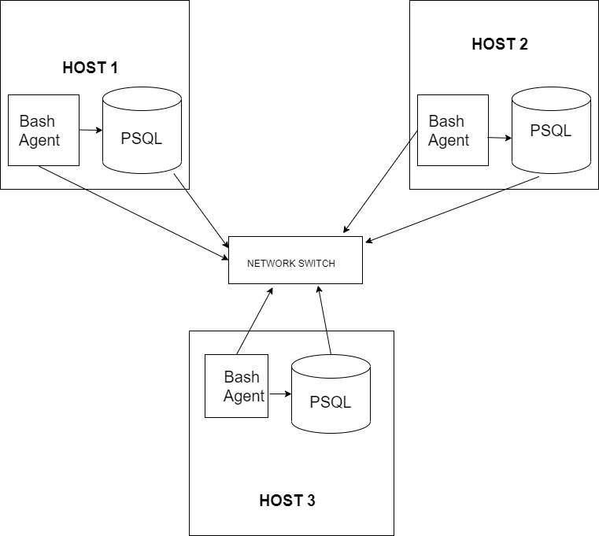

Introduction
============
This application provides information
on hardware specifications and real-time resource usage
(such as CPU and memory) for each node within a system of
nodes/servers connected through a network switch.
The information is stored and retrieved from a PostgreSQL database,
which is provisioned using Docker. A bash agent is used to gather 
server usage data and insert it into the database. The bash agent
consists of two bash scripts. The host_info.sh bash script inserts
the host hardware information into the database and is run once. The host_usage.sh
script collects the current host usage and inserts it into the 
database, and this process is automated using crontab. All of the source code is
available on the project's GitHub repository.

Quick Start
===========
Start a psql instance using psql_docker.sh
```
./scripts/psql_docker.sh start|stop|create [db_username][db_password]
```
Create tables using ddl.sql
```
psql -h localhost -U postgres -d host_agent -f sql/ddl.sql
```
Insert hardware specs data into the database using 
host_info.sh
```
./scripts/host_info.sh psql_host psql_port db_name psql_user psql_password
```
Insert hardware usage dta into the database using 
host_usage.sh
```
bash scripts/host_usage.sh psql_host psql_port db_name psql_user psql_password
```
Setup crontab
```
#edit crontab jobs
bash> crontab -e

#add this to crontab
* * * * * bash /home/centos/dev/jrvs/bootcamp/linux_sql/host_agent/scripts/host_usage.sh localhost 5432 host_agent postgres password > /tmp/host_usage.log

#list crontab jobs
crontab -l
```

Implementation
==============
A PSQL database, provisioned using Docker, will be used to store all the relevant information on hardware specs
and usage. Every host will have access to this database using the host_usage.sh and host_info.sh bash scripts. crontab will be used to run the host_usage
script every minute.

Architecture
============


Scripts
=======
- psql_docker.sh provisions a psql container using docker
- host_info.sh collects the host hardware info and inserts it into the database
- host_usage.sh collects the current host usage and inserts it into the database
- crontab runs host usage every minute
- queries.sql: the SQL queries use the database to perform several tasks: 1) Group hosts by CPU number and sort by their memory size. 2. Obtain average memory used over a 5 minute interval for each host 3) Detect host failure, which is when the cronjob fails to insert a new entry every minute

Database Modelling
==================
host_info

| Attribute        | Type      |
|------------------|-----------|
| id               | SERIAL    |
| hostname         | varchar   |
| cpu_number       | int       |
| cpu_architecture | varchar   |
| cpu_model        | varchar   |
| cpu_mhz          | real      |
| L2_cache         | int       |
| total_mem        | int       |
| "timestamp"      | timestamp |
| PRIMARY KEY(id)  |           |

host_usage

| Attribute            | Type                                   |
|----------------------|----------------------------------------|
| "timestamp"          | timestamp                              |
| host_id              | serial references public.host_info(id) |
| memory_free          | int                                    |
| cpu_idle             | int                                    |
| cpu_kernel           | int                                    |
| disk_io              | int                                    |
| disk_available       | int                                    |
| PRIMARY KEY(host_id) |                                        |

Test
====
The bash scripts were tested by being run on the command line. To ensure the proper operation of the psql_docker.sh bash script, a verification was made as to whether a docker container was running. To ensure the proper operation of the host_info.sh and host_usage.sh bash scripts, a verification was made in the PSQL database to ensure that the data was properly inserted into the database. Lastly, the SQL queries were tested by means of being run on the PSQL database. They were modified until they ran successfully.

Deployment
==========
The PostgreSQL database was provisioned using Docker. To automate the host_usage.sh script, crontab was used and configured with the proper cron job. GitHub is used to store and manage the source code.

Improvements
============
There are several ways in which this project can be improved:
1. One single program can be created to automatically run the steps in quick start
2. A graphical user interface can be created instead of a command line interface
3. Expand the two database tables to hold even more information and expand the program to run even more advanced queries 
